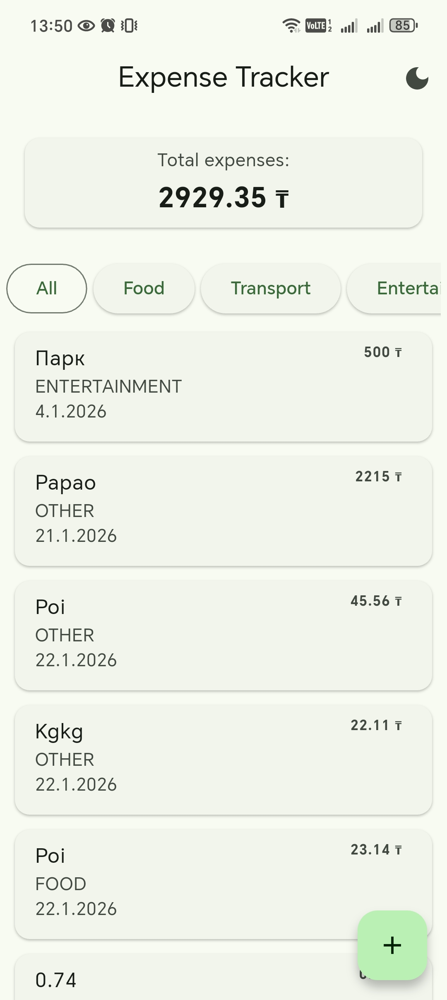
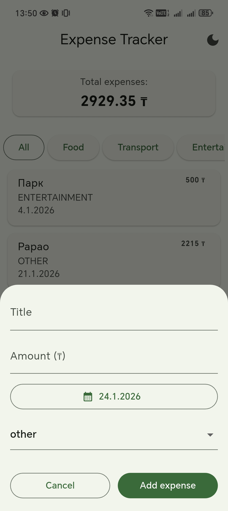
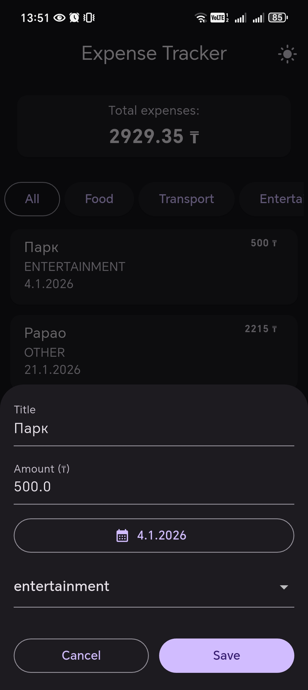

# Expense Tracker

A simple Flutter expense tracker app to add, edit, delete daily expenses.

## 📱 Screenshots




## ✨ Features
- Add expenses with title, amount, date, and category
- Edit existing expenses
- Swipe to delete with confirmation
- Smart amount formatting (shows decimals only when needed)
- Persistent local storage
- Clean Material 3 UI

## 🛠 Tech Stack
- Flutter
- Dart
- Material 3
- Hive for expenses storage
- SharedPreferences for app settings

## 🚀 Getting Started
```bash
flutter pub get
flutter run
```

## 📌 Version
v1.0.0
